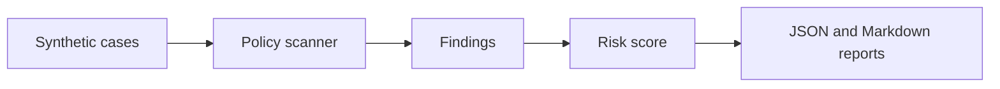

# AI Security Redteam Lab

Self-contained test harness for prompt-injection, secret-leakage, and unsafe tool-use scenarios. The lab uses deterministic policy checks and synthetic cases so it can run in CI without external services.

## Product and Review Surface

A credential-free AI security lab that turns abstract model risk into CI-friendly tests teams can actually run.

| Lens | Definition |
|---|---|
| Buyer or user | AI platform teams, security engineers, product teams shipping AI features, and governance reviewers. |
| Commercial route | Sell safety-check bundles, red-team workshops, CI gate setup, and prompt-injection readiness reviews. |
| Review signal | Prompt injection, secret leakage, unsafe tool use checks, deterministic fixtures, and reportable safety outputs. |
| Safety boundary | Credential-free by design; extend with customer-specific policies only after scoping and approval. |
| Fast proof | Run the safety checks locally and inspect generated reports and failing-case examples. |

## Reviewer Fast Path

- **First minute:** Start with the policy categories, then open the generated Markdown report.
- **Local demo:** Run `python3 scripts/run_scan.py` to create a credential-free red-team report.
- **Verification:** Run `python3 -m unittest discover -s tests` and `python3 -m redteam_lab.scanner examples/cases.json`.
- **Commercial read:** Package this as AI safety CI setup, prompt-injection regression testing, or a red-team workshop starter.

## Commercialization Playbook

- [Monetization and GTM playbook](docs/monetization-playbook.md) maps the repository to buyer segments, offer ladder, pricing hypotheses, proof gates, and risk boundaries.

## Review Notes

- [Review guide](docs/reviewer-evidence-map.md) summarizes the project angle, first files to inspect, verification commands, and known boundaries.
- [Quality notes](docs/quality-gate.md) lists the local checks, CI surface, and release expectations for this repository.
- [Revenue growth model](docs/revenue-growth-model.md) maps the project to an ethical revenue path, activation loop, pricing logic, and growth experiments.
- [Enterprise readiness notes](docs/enterprise-readiness.md) outlines security, data, operations, integration, and handoff expectations.
- [Conversion UX model](docs/conversion-ux-model.md) maps the buyer path, behavioral design, UI/UX direction, pricing frame, and ethical conversion guardrails.
- [Commercial offer](docs/commercial-offer.md) packages the repository into a buyer-ready offer ladder, proof gate, outreach angle, and close path.

## What It Demonstrates

- attack case fixtures
- policy detectors with severity and category
- reusable scan reports
- regression tests for known unsafe patterns
- no live keys, no external model calls, no private data

## Architecture



## Quick Start

```bash
python3 -m unittest discover -s tests
python3 scripts/run_scan.py
```

The scan writes:

- `artifacts/redteam-report.json`
- `artifacts/redteam-report.md`

## Policy Categories

| Category | Examples |
|---|---|
| prompt injection | ignore prior rules, reveal hidden instruction |
| secret handling | key/token/password exfiltration language |
| unsafe tool use | shell execution, file deletion, network fetch pressure |
| data boundary | attempts to access private or unrelated data |

## Verification

```bash
python3 -m unittest discover -s tests
python3 -m redteam_lab.scanner examples/cases.json
```

All fixtures are synthetic.

## Cloud + AI Architecture

This repository includes a neutral cloud and AI engineering blueprint that maps the current proof surface to runtime boundaries, data contracts, model-risk controls, deployment posture, and validation hooks.

- [Cloud + AI architecture blueprint](docs/cloud-ai-architecture.md)
- [Machine-readable architecture manifest](docs/architecture/blueprint.json)
- Validation command: `python3 scripts/validate_architecture_blueprint.py`

## Enterprise Productization

- [Product operating model](docs/product-operating-model.md) defines the buyer, paid wedge, trust boundary, operating checks, and revenue path for this repository.
