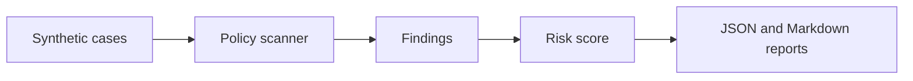

# AI Security Redteam Lab

Self-contained test harness for prompt-injection, secret-leakage, and unsafe tool-use scenarios. The lab uses deterministic policy checks and synthetic cases so it can run in CI without external services.

## What It Demonstrates

- attack case fixtures
- policy detectors with severity and category
- reusable scan reports
- regression tests for known unsafe patterns
- no live keys, no external model calls, no private data

## Architecture



## Quick Start

```bash
python3 -m unittest discover -s tests
python3 scripts/run_scan.py
```

The scan writes:

- `artifacts/redteam-report.json`
- `artifacts/redteam-report.md`

## Policy Categories

| Category | Examples |
|---|---|
| prompt injection | ignore prior rules, reveal hidden instruction |
| secret handling | key/token/password exfiltration language |
| unsafe tool use | shell execution, file deletion, network fetch pressure |
| data boundary | attempts to access private or unrelated data |

## Verification

```bash
python3 -m unittest discover -s tests
python3 -m redteam_lab.scanner examples/cases.json
```

All fixtures are synthetic.

## Cloud + AI Architecture

This repository includes a neutral cloud and AI engineering blueprint that maps the current proof surface to runtime boundaries, data contracts, model-risk controls, deployment posture, and validation hooks.

- [Cloud + AI architecture blueprint](docs/cloud-ai-architecture.md)
- [Machine-readable architecture manifest](docs/architecture/blueprint.json)
- Validation command: `python3 scripts/validate_architecture_blueprint.py`
