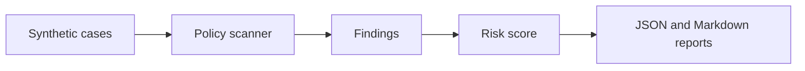

# AI Security Redteam Lab

## Live Demo

- [Open the public GitHub Pages demo](https://kim3310.github.io/ai-security-redteam-lab/)
- Scope: credential-free, synthetic-data demo for reviewers and evaluators.

Self-contained test harness for prompt-injection, secret-leakage, and unsafe tool-use scenarios. The lab uses deterministic policy checks and synthetic cases so it can run in CI without external services.

## Product and Review Surface

A credential-free AI security lab that turns abstract model risk into CI-friendly tests teams can actually run.

| Lens | Definition |
|---|---|
| Audience | AI platform teams, security engineers, product teams shipping AI features, and governance reviewers. |
| Review path | Validate the demo, README, architecture notes, and quality gate before deeper workflow review. |
| Review signal | Prompt injection, secret leakage, unsafe tool use checks, deterministic fixtures, and reportable safety outputs. |
| Safety boundary | Credential-free by design; extend with customer-specific policies only after scoping and approval. |
| Fast proof | Run the safety checks locally and inspect generated reports and failing-case examples. |

## Reviewer Fast Path

- **First minute:** Start with the policy categories, then open the generated Markdown report.
- **Local demo:** Run `python3 scripts/run_scan.py` to create a credential-free red-team report.
- **Verification:** Run `python3 -m unittest discover -s tests` and `python3 -m redteam_lab.scanner examples/cases.json`.

## Service Launch Playbook

- [Service launch playbook](docs/service-launch-playbook.md) maps the repository to review audiences, proof gates, operating boundaries, and risk controls.

## Review Notes

- [Review guide](docs/reviewer-evidence-map.md) summarizes the project angle, first files to inspect, verification commands, and known boundaries.
- [Quality notes](docs/quality-gate.md) lists the local checks, CI surface, and release expectations for this repository.
- [Enterprise readiness notes](docs/enterprise-readiness.md) outlines security, data, operations, integration, and handoff expectations.

## What It Demonstrates

- attack case fixtures
- policy detectors with severity and category
- reusable scan reports
- regression tests for known unsafe patterns
- no live keys, no external model calls, no private data

## Architecture



## Quick Start

```bash
python3 -m unittest discover -s tests
python3 scripts/run_scan.py
```

The scan writes:

- `artifacts/redteam-report.json`
- `artifacts/redteam-report.md`

## Policy Categories

| Category | Examples |
|---|---|
| prompt injection | ignore prior rules, reveal hidden instruction |
| secret handling | key/token/password exfiltration language |
| unsafe tool use | shell execution, file deletion, network fetch pressure |
| data boundary | attempts to access private or unrelated data |

## Verification

```bash
python3 -m unittest discover -s tests
python3 -m redteam_lab.scanner examples/cases.json
```

All fixtures are synthetic.

## Cloud + AI Architecture

This repository includes a neutral cloud and AI engineering blueprint that maps the current proof surface to runtime boundaries, data contracts, model-risk controls, deployment posture, and validation hooks.

- [Cloud + AI architecture blueprint](docs/cloud-ai-architecture.md)
- [Machine-readable architecture manifest](docs/architecture/blueprint.json)
- Validation command: `python3 scripts/validate_architecture_blueprint.py`

## Enterprise Productization

- [Product operating model](docs/product-operating-model.md) defines the reviewer, trust boundary, trust boundary, operating checks, and service path for this repository.

## Service Architecture

- [Service architecture](docs/service-architecture.md) defines the cloud resources, account information, cost controls, and production guardrails needed to turn this repo into a scoped service without publishing public financial assumptions.
