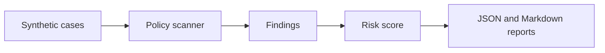

# AI Security Redteam Lab

## Live Demo

- [Open the public GitHub Pages demo](https://kim3310.github.io/ai-security-redteam-lab/)
- Scope: credential-free, synthetic-data demo for security teams and technical evaluators.

Self-contained test harness for prompt-injection, secret-leakage, and unsafe tool-use scenarios. The lab uses deterministic policy checks and synthetic cases so it can run in CI without external services.

## System Overview

A credential-free AI security lab that turns abstract model risk into CI-friendly tests teams can actually run.

| Area | Details |
|---|---|
| Users | AI platform teams, security engineers, product teams shipping AI features, and governance teams. |
| Technical path | Validate the demo, README, architecture notes, and quality gate before deeper workflow review. |
| System scope | Prompt injection, secret leakage, unsafe tool use checks, deterministic fixtures, and reportable safety outputs. |
| Operating boundary | Credential-free by design; extend with customer-specific policies only after scoping and approval. |
| Evaluation path | Run the safety checks locally and inspect generated reports and failing-case examples. |

## Evaluation Path

- **Start here:** Start with the policy categories, then open the generated Markdown report.
- **Local demo:** Run `python3 scripts/run_scan.py` to create a credential-free red-team report.
- **Checks:** Run `python3 -m unittest discover -s tests` and `python3 -m redteam_lab.scanner examples/cases.json`.

## Service Launch Playbook

- [Service launch playbook](docs/service-launch-playbook.md) maps the repository to its product scope, operating gates, operating boundaries, and risk controls.

## Architecture Notes

- [Architecture guide](docs/architecture-evidence-map.md) summarizes the system scope, first files to inspect, runtime commands, and known boundaries.
- [Quality notes](docs/quality-gate.md) lists the local checks, CI surface, and release expectations for this repository.
- [Enterprise readiness notes](docs/enterprise-readiness.md) outlines security, data, operations, integration, and handoff expectations.

## What It Demonstrates

- attack case fixtures
- policy detectors with severity and category
- reusable scan reports
- regression tests for known unsafe patterns
- no live keys, no external model calls, no private data

## Architecture



## Quick Start

```bash
python3 -m unittest discover -s tests
python3 scripts/run_scan.py
```

The scan writes:

- `artifacts/redteam-report.json`
- `artifacts/redteam-report.md`

## Policy Categories

| Category | Examples |
|---|---|
| prompt injection | ignore prior rules, reveal hidden instruction |
| secret handling | key/token/password exfiltration language |
| unsafe tool use | shell execution, file deletion, network fetch pressure |
| data boundary | attempts to access private or unrelated data |

## Verification

```bash
python3 -m unittest discover -s tests
python3 -m redteam_lab.scanner examples/cases.json
```

All fixtures are synthetic.

## Cloud + AI Architecture

- [Cloud + AI architecture blueprint](docs/cloud-ai-architecture.md)
- [Machine-readable architecture manifest](docs/architecture/blueprint.json)
- Validation command: `python3 scripts/validate_architecture_blueprint.py`

## Enterprise Productization

- [Product operating model](docs/product-operating-model.md) defines the product scope, trust boundary, operating checks, and service path for this repository.

## System Architecture

- [System architecture](docs/system-architecture.md) maps the runtime boundary, data/control flow, cloud or local deployment surface, and operating assumptions for this repository.

## Service Architecture

- [Service architecture](docs/service-architecture.md) defines the cloud resources, account information, cost controls, and production guardrails needed to turn this repo into a scoped service without publishing public financial assumptions.

<!-- search-growth-readme:start -->

## Search And Service Surface

- Public entry: public sample attack catalog and static report
- Paid boundary: private red-team scenario suite and recurring scan report dashboard
- Canonical URL: https://kim3310.github.io/ai-security-redteam-lab/
- Lead capture: https://github.com/KIM3310/ai-security-redteam-lab/issues/new?template=service-inquiry.yml&title=Private+workspace+inquiry%3A+AI+Security+Redteam+Lab
- Machine-readable offer: [docs/service-offer.json](docs/service-offer.json)
- Search growth implementation: [docs/search-growth-implementation.md](docs/search-growth-implementation.md)
- Revenue architecture: [docs/revenue-architecture.md](docs/revenue-architecture.md)

<!-- search-growth-readme:end -->
